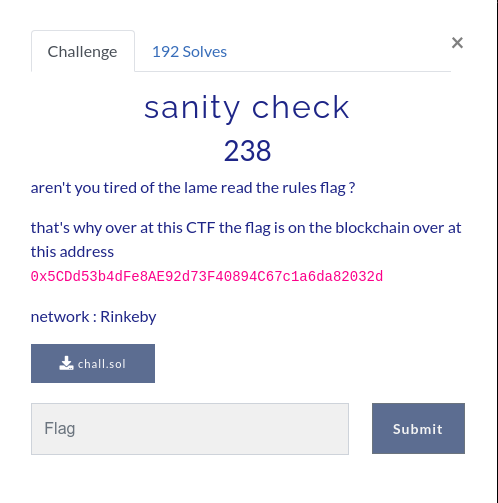
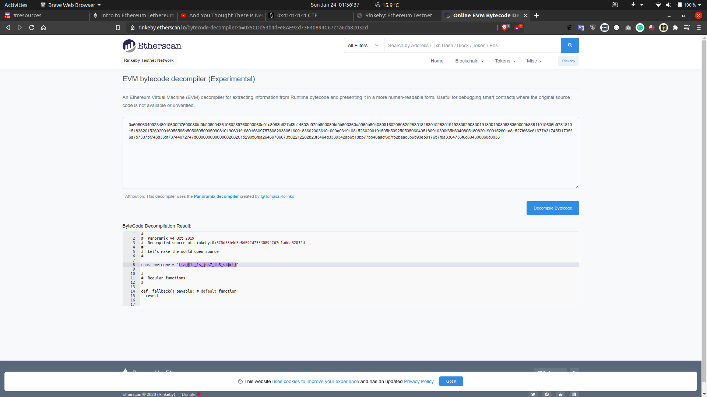
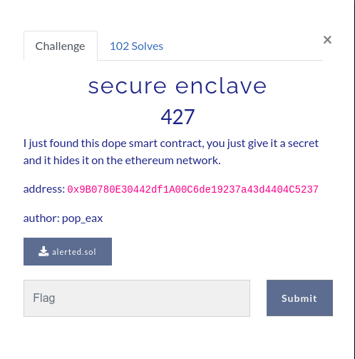
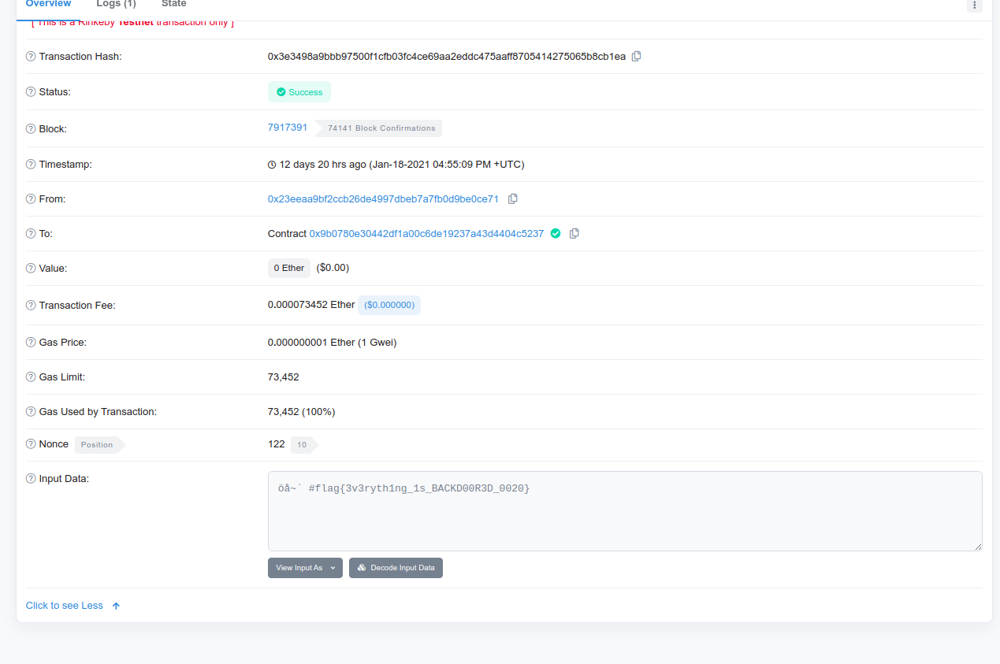
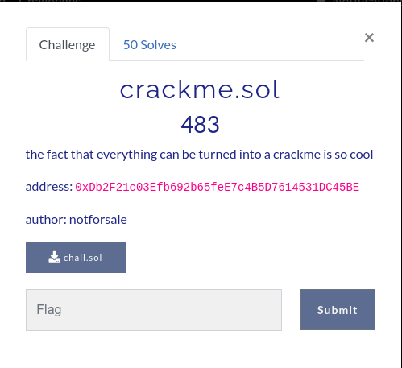
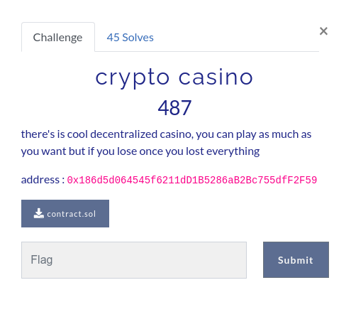

# Table of contents
- ## [Sanity Check](#sanity-check)
- ## [Secure Enclave](#secure-enclave)
- ## [Crackme](#crackme)
- ## [Crypto Casino](#crypto-casino)
  
---

# Notes

### For some of the challenges, a rinkeby testnet wallet account is required. Make sure to get one before doing.

### I'm using Ubuntu 20.04 as my environment.

---


# Sanity Check


## Information: 
Contract address: ```0x5CDd53b4dFe8AE92d73F40894C67c1a6da82032d```
The dialog gave us a contract address, cryptocurrency network and source code.

## My solution: 
1. Google search for a network explorer (e.g. [etherscan](https://rinkeby.etherscan.io/))
2. Select network as Rinkeby
3. Paste the wallet address for searching
4. Decompile the contract creation bytecode 
   
Screenshot:


## Flag: flag{1t_1s_jus7_th3_st@rt}  


---

# Secure Enclave


## Information:

> alerted.sol

Contract address: ```0x9B0780E30442df1A00C6de19237a43d4404C5237```
```
pragma solidity ^0.6.0;

contract secure_enclave {
    event pushhh(string alert_text); // <- 


    struct Secret {
        address owner;
        string secret_text;
    }

    mapping(address => Secret) private secrets;

    function set_secret(string memory text) public {
        secrets[msg.sender] = Secret(msg.sender, text);
        emit pushhh(text);
    }

    function get_secret() public view returns (string memory){
        return secrets[msg.sender].secret_text;
    }

}
```

## My solution
The source code indicates that if someone called the contract's function ```set_secret()```, the contract will return the flag to the person who called it.

At the time i solve it, i was able to find a transaction with the flag in it. The transaction id is ```0x3e3498a9bbb97500f1cfb03fc4ce69aa2eddc475aaff8705414275065b8cb1ea```

Screenshot:


## Flag: flag{3v3ryth1ng_1s_BACKD00R3D_0020}

---

# Crackme


## Information

Contract address: ```0xDb2F21c03Efb692b65feE7c4B5D7614531DC45BE```

> crackme.sol

```
pragma solidity ^0.6.0;

contract crack_me{

    function gib_flag(uint arg1, string memory arg2, uint arg3) public view returns (uint[]){
        //arg3 is a overflow
        require(arg3 > 0, "positive nums only baby");
        if ((arg1 ^ 0x70) == 20) {
            if(keccak256(bytes(decrypt(arg2))) == keccak256(bytes("offshift ftw"))) {
                uint256 check3 = arg3 + 1;
                if( check3< 1) {
                    return flag;
                }
            }
        }
        return "you lost babe";
    }

    function decrypt(string memory encrypted_text) private pure returns (string memory){
        uint256 length = bytes(encrypted_text).length;
        for (uint i = 0; i < length; i++) {
            byte char = bytes(encrypted_text)[i];
            assembly {
                char := byte(0,char)
                if and(gt(char,0x60), lt(char,0x6E))
                { char:= add(0x7B, sub(char,0x61)) }
                if iszero(eq(char, 0x20))
                {mstore8(add(add(encrypted_text,0x20), mul(i,1)), sub(char,16))}
            }
        }
        return encrypted_text;
    }
}
```

Personally i think this is similar to a reverse-engineer challenge. I need to call the contract's ```gib_flag()``` function to get the flag.


---
gib_flag | arg1 | arg2 | arg3
---------|------|------|-----
condition | user_input ^ 0x70 == 20 |decrypt(user_input) == "offshift ftw"| user_input + 1 < 0
correct input|Dec: 100 or Hex: 0x64|"evvixyvj vjm"|2**256 - 1 (Will cause overflow after += 1)

---

## My solution
1. using python's brownie library
2. run ```brownie init crackme_ctf```
3. copy ```chall.sol``` into the generated ```contracts/``` folder
4. do some modification to the ```chall.sol``` to make it compilable
```
> crackme_ctf/contracts/chall.sol
pragma solidity ^0.6.0;

contract crack_me{
    string flag = "yeah"; // <- i added this line

    function gib_flag(uint arg1, string memory arg2, uint arg3) public view returns (string memory){
        //arg3 is a overflow
        require(arg3 > 0, "positive nums only baby");

    .
    .
    .
```
5. copy the entire code from ```chall.sol``` to another ```test.sol``` file in ```contracts/```


> crackme_ctf/contracts/test.sol
```
pragma solidity ^0.6.0;

contract hello{ // <- remember to change the contract name

    function gib_flag(uint arg1, string memory arg2, uint arg3) public view returns (string memory){
        //arg3 is a overflow
        require(arg3 > 0, "positive nums only baby");
        if ((arg1 ^ 0x70) == 20) {
            if(keccak256(bytes(decrypt(arg2))) == keccak256(bytes("offshift ftw"))) {
                uint256 check3 = arg3 + 1;
                if( check3< 1) {
                    return "yeah you reversed it"; // <- replaced the flag variable with a string
                }
            }
        }
        return "you lost babe";
    }

    // *** remember to change this function to public 
    function decrypt(string memory encrypted_text) public pure returns (string memory){
        uint256 length = bytes(encrypted_text).length;
        for (uint i = 0; i < length; i++) {
            byte char = bytes(encrypted_text)[i];
            assembly {
                char := byte(0,char)
                if and(gt(char,0x60), lt(char,0x6E))
                { char:= add(0x7B, sub(char,0x61)) }
                if iszero(eq(char, 0x20))
                {mstore8(add(add(encrypted_text,0x20), mul(i,1)), sub(char,16))}
            }
        }
        return encrypted_text;
    }
}
```
6. write a script to bruteforce the value for arg3
> crackme_ctf/scripts/test.py
```
from brownie import *

def main():
    accounts.add()  # Create a new local wallet account

    d = hello.deploy({"from":accounts[0]})

    target = "offshift ftw"
    stored = ""

    # Valid ascii characters
    for _ in range(32,128):
        stored += str(chr(_))

    ans = ""
    for x in range(len(target)):
        for c in range(128):
            tmp = d.decrypt(stored[c])
            if(tmp == target[x]):
                ans += stored[c]
                break

    print(ans)
```
```
Output of: $ brownie run scripts/test.py

Brownie v1.13.0 - Python development framework for Ethereum

CrackmeCtfProject is the active project.

Launching 'ganache-cli --port 8545 --gasLimit 12000000 --accounts 10 --hardfork istanbul --mnemonic brownie'...

Running 'scripts/test.py::main'...
mnemonic: 'piece multiply pet next panel off special sketch dose illness domain naive'
Transaction sent: 0x128e7a11fc664a3592afdb4db2550d3b368ccc2a95b8f0f6bea8a8442350eb64
  Gas price: 0.0 gwei   Gas limit: 12000000   Nonce: 0
  hello.constructor confirmed - Block: 1   Gas used: 287601 (2.40%)
  hello deployed at: 0x3194cBDC3dbcd3E11a07892e7bA5c3394048Cc87

evvixyvj vjm <- user_input for arg3

Terminating local RPC client...
```
7. ```$ brownie console --network rinkeby```
```
Brownie v1.13.0 - Python development framework for Ethereum

CrackmeCtfProject is the active project.
Brownie environment is ready.
>>> myWallet = accounts.add(YOUR_OWN_RINKEBY_NETWORK_WALLET_PRIVATE_KEY)
>>> d = web3.eth.contract(
... address="0xDb2F21c03Efb692b65feE7c4B5D7614531DC45BE",
... abi=crack_me.abi
... )
>>> d.functions.gib_flag(100,"evvixyvj vjm",2**256-1).call()
```

8. Process the error manually

```
  File "<console>", line 1, in <module>
  File "web3/contract.py", line 954, in call
    return call_contract_function(
  File "web3/contract.py", line 1529, in call_contract_function
    raise BadFunctionCallOutput(msg) from e
BadFunctionCallOutput: Could not decode contract function call gib_flag return data b'\x00\x00\x00.......\x00\x00\x004' for output_types ['string']
>>> return_data = "\x00\x00\x00\x00\x00\x00\x00\x00\x00\x00\x00\x00\x00\x00\x00\x00\x00\x00\x00\x00\x00\x00\x00\x00\x00\x00\x00\x00\x00\x00\x00C\x00\x00\x00\x00\x00\x00\x00\x00\x00\x00\x00\x00\x00\x00\x0
0\x00\x00\x00\x00\x00\x00\x00\x00\x00\x00\x00\x00\x00\x00\x00\x000\x00\x00\x00\x00\x00\x00\x00\x00\x00\x00\x00\x00\x00\x00\x00\x00\x00\x00\x00\x00\x00\x00\x00\x00\x00\x00\x00\x00\x00\x00\x00n\x00\x00\x00
\x00\x00\x00\x00\x00\x00\x00\x00\x00\x00\x00\x00\x00\x00\x00\x00\x00\x00\x00\x00\x00\x00\x00\x00\x00\x00\x00\x00g\x00\x00\x00\x00\x00\x00\x00\x00\x00\x00\x00\x00\x00\x00\x00\x00\x00\x00\x00\x00\x00\x00\x
00\x00\x00\x00\x00\x00\x00\x00\x00r\x00\x00\x00\x00\x00\x00\x00\x00\x00\x00\x00\x00\x00\x00\x00\x00\x00\x00\x00\x00\x00\x00\x00\x00\x00\x00\x00\x00\x00\x00\x00@\x00\x00\x00\x00\x00\x00\x00\x00\x00\x00\x0
0\x00\x00\x00\x00\x00\x00\x00\x00\x00\x00\x00\x00\x00\x00\x00\x00\x00\x00\x00\x007\x00\x00\x00\x00\x00\x00\x00\x00\x00\x00\x00\x00\x00\x00\x00\x00\x00\x00\x00\x00\x00\x00\x00\x00\x00\x00\x00\x00\x00\x00\
x005\x00\x00\x00\x00\x00\x00\x00\x00\x00\x00\x00\x00\x00\x00\x00\x00\x00\x00\x00\x00\x00\x00\x00\x00\x00\x00\x00\x00\x00\x00\x00_\x00\x00\x00\x00\x00\x00\x00\x00\x00\x00\x00\x00\x00\x00\x00\x00\x00\x00\x
00\x00\x00\x00\x00\x00\x00\x00\x00\x00\x00\x00\x00Y\x00\x00\x00\x00\x00\x00\x00\x00\x00\x00\x00\x00\x00\x00\x00\x00\x00\x00\x00\x00\x00\x00\x00\x00\x00\x00\x00\x00\x00\x00\x000\x00\x00\x00\x00\x00\x00\x0
0\x00\x00\x00\x00\x00\x00\x00\x00\x00\x00\x00\x00\x00\x00\x00\x00\x00\x00\x00\x00\x00\x00\x00\x00u\x00\x00\x00\x00\x00\x00\x00\x00\x00\x00\x00\x00\x00\x00\x00\x00\x00\x00\x00\x00\x00\x00\x00\x00\x00\x00\
x00\x00\x00\x00\x00_\x00\x00\x00\x00\x00\x00\x00\x00\x00\x00\x00\x00\x00\x00\x00\x00\x00\x00\x00\x00\x00\x00\x00\x00\x00\x00\x00\x00\x00\x00\x00C\x00\x00\x00\x00\x00\x00\x00\x00\x00\x00\x00\x00\x00\x00\x
00\x00\x00\x00\x00\x00\x00\x00\x00\x00\x00\x00\x00\x00\x00\x00\x00R\x00\x00\x00\x00\x00\x00\x00\x00\x00\x00\x00\x00\x00\x00\x00\x00\x00\x00\x00\x00\x00\x00\x00\x00\x00\x00\x00\x00\x00\x00\x00@\x00\x00\x0
0\x00\x00\x00\x00\x00\x00\x00\x00\x00\x00\x00\x00\x00\x00\x00\x00\x00\x00\x00\x00\x00\x00\x00\x00\x00\x00\x00\x00C\x00\x00\x00\x00\x00\x00\x00\x00\x00\x00\x00\x00\x00\x00\x00\x00\x00\x00\x00\x00\x00\x00\
x00\x00\x00\x00\x00\x00\x00\x00\x00K\x00\x00\x00\x00\x00\x00\x00\x00\x00\x00\x00\x00\x00\x00\x00\x00\x00\x00\x00\x00\x00\x00\x00\x00\x00\x00\x00\x00\x00\x00\x003\x00\x00\x00\x00\x00\x00\x00\x00\x00\x00\x
00\x00\x00\x00\x00\x00\x00\x00\x00\x00\x00\x00\x00\x00\x00\x00\x00\x00\x00\x00\x00D\x00\x00\x00\x00\x00\x00\x00\x00\x00\x00\x00\x00\x00\x00\x00\x00\x00\x00\x00\x00\x00\x00\x00\x00\x00\x00\x00\x00\x00\x00
\x00_\x00\x00\x00\x00\x00\x00\x00\x00\x00\x00\x00\x00\x00\x00\x00\x00\x00\x00\x00\x00\x00\x00\x00\x00\x00\x00\x00\x00\x00\x00\x00m\x00\x00\x00\x00\x00\x00\x00\x00\x00\x00\x00\x00\x00\x00\x00\x00\x00\x00\
x00\x00\x00\x00\x00\x00\x00\x00\x00\x00\x00\x00\x003\x00\x00\x00\x00\x00\x00\x00\x00\x00\x00\x00\x00\x00\x00\x00\x00\x00\x00\x00\x00\x00\x00\x00\x00\x00\x00\x00\x00\x00\x00\x008\x00\x00\x00\x00\x00\x00\x
00\x00\x00\x00\x00\x00\x00\x00\x00\x00\x00\x00\x00\x00\x00\x00\x00\x00\x00\x00\x00\x00\x00\x00\x005\x00\x00\x00\x00\x00\x00\x00\x00\x00\x00\x00\x00\x00\x00\x00\x00\x00\x00\x00\x00\x00\x00\x00\x00\x00\x00
\x00\x00\x00\x00\x004"
>>> for a in return_data:
...     if(a != '\x00'):
...         print(a,end='')
...
C0ngr@75_Y0u_CR@CK3D_m3854>>>
```

## Flag: flag{C0ngr@75_Y0u_CR@CK3D_m3854}

---


# Crypto Casino



## Information

Contract address: ```0x186d5d064545f6211dD1B5286aB2Bc755dfF2F59```

> contract.sol
```
pragma solidity ^0.6.0;

contract casino {

    bytes32 private seed;
    mapping(address => uint) public consecutiveWins;

    constructor () public{
        seed = keccak256("satoshi nakmoto");
    }

    function bet(uint guess) public{
        uint num = uint(keccak256(abi.encodePacked(seed, block.number))) ^ 0x539;
        if (guess == num) {
            consecutiveWins[msg.sender] = consecutiveWins[msg.sender] + 1;
        }else {
            consecutiveWins[msg.sender] = 0;
        }
    }

    function done() public view returns (uint16[] memory) {
        if (consecutiveWins[msg.sender] > 1) {
            return [];
        }
    }

}
```
- ```seed``` is known, which is ```keccak256("satoshi nakmoto")```
- i need to ```bet()``` for 2 times in a row successfully 
- i need to replicate ```abi.encodePacked(seed,block.number)``` in python
- ```block.number``` is the length of the chain of rinkeby at the moment ```bet()``` was called

## Solution

For ```seed```, we can get it on ```brownie console``` by running ```web3.keccak(text="satoshi nakmoto")```
```
>>> web3.keccak(text="satoshi nakmoto")
HexBytes('0xb37c910f4e0df0efafb35a55489604369808b6de642ff1dbab5062680afaddcd')
```

For the value of ```abi.encodePacked(seed,block.number)```, i reversed it by trial and error in my local blockchain network

This following is the result of ```abi.encodePacked(seed,block.number)``` where block.number is 1 and 15.
seed|block.number|abi.encodePacked
-|-|-
"b37c910f4e0df0efafb35a55489604369808b6de642ff1dbab5062680afaddcd"|1|"b37c910f4e0df0efafb35a55489604369808b6de642ff1dbab5062680afaddcd0000000000000000000000000000000000000000000000000000000000000001"
"b37c910f4e0df0efafb35a55489604369808b6de642ff1dbab5062680afaddcd"|15|"b37c910f4e0df0efafb35a55489604369808b6de642ff1dbab5062680afaddcd000000000000000000000000000000000000000000000000000000000000000f"

Now ```abi.encodePacked(seed,block.number)``` was reversed, time to make some bet.

1. In a directory, run ```brownie init crypto_casino_ctf```
   
> crypto_casino_ctf/contracts/contract.sol

```
pragma solidity ^0.6.0;

contract casino {

    bytes32 private seed;
    mapping(address => uint) public consecutiveWins;

    constructor () public{
        seed = keccak256("satoshi nakmoto");
    }

    function bet(uint guess) public{
        uint num = uint(keccak256(abi.encodePacked(seed, block.number))) ^ 0x539;
        if (guess == num) {
            consecutiveWins[msg.sender] = consecutiveWins[msg.sender] + 1;
        }else {
            consecutiveWins[msg.sender] = 0;
        }
    }

    function done() public view returns (string memory) {
        if (consecutiveWins[msg.sender] > 1) {
            return "you broke the casino";  // <- replace with some string to let it compile successfully
        }
    }

}
```

> crypto_casino_ctf/scripts/test.py

```
from brownie import *


def main():
    network.disconnect()
    network.connect("rinkeby")


    network.gas_limit(50000) # set how much i am willing to pay

    accounts.add(YOUR_OWN_RINKEBY_NETWORK_WALLET_PRIVATE_KEY)

    d = Contract.from_abi(
        address="0x186d5d064545f6211dD1B5286aB2Bc755dfF2F59",
        abi=casino.abi,
        name="target"
    )

    # just in case i didn't guess it in the first 2 round
    for k in range(3):
        for i in range(2):
            current_block_height = "%064x" % (chain.height+1)
            seed = "b37c910f4e0df0efafb35a55489604369808b6de642ff1dbab5062680afaddcd" + current_block_height

            print("Doing block height (hex):",current_block_height)
            print("Doing block height (dec): %064d"%(chain.height+1))

            ''' Replica of abi.encodePacked(seed,block.number) '''
            _bytes = bytes.fromhex(seed)
            _encodePacked = int.from_bytes(_bytes, byteorder="big")
            _hexBytes = web3.keccak(_encodePacked)

            guess = int(_hexBytes.hex(), 16) ^ 0x539

            print(d.bet(guess, {"from": accounts[0].address}))
        print("result", d.done({"from": accounts[0].address}))

```
2. ```$ brownie run scripts/test.py```

```
Brownie v1.13.0 - Python development framework for Ethereum

CryptoCasinoCtfProject is the active project.

Launching 'ganache-cli --port 8545 --gasLimit 12000000 --accounts 10 --hardfork istanbul --mnemonic brownie'...

Running 'scripts/test.py::main'...
Terminating local RPC client...
Transaction sent: 0x9fb6e2c090be7520b86a5b53a4bc21a2a500f69a0b17305650b041ff9dbd5293
  Gas price: 1.0 gwei   Gas limit: 50000   Nonce: 36
  target.bet confirmed - Block: 7991824   Gas used: 13928 (27.86%)

<Transaction '0x9fb6e2c090be7520b86a5b53a4bc21a2a500f69a0b17305650b041ff9dbd5293'>
Transaction sent: 0x59c75618de39bdbd7c4239542388c1a9bb4ebd848c1cbd2086c86b3cc89030e7
  Gas price: 1.0 gwei   Gas limit: 50000   Nonce: 37
  target.bet confirmed - Block: 7991825   Gas used: 43690 (87.38%)

<Transaction '0x59c75618de39bdbd7c4239542388c1a9bb4ebd848c1cbd2086c86b3cc89030e7'>
result 
Transaction sent: 0xb5ebc12b5fcc080c39874b8e43beb420cc8fc093528ec36a891df53d2ff7ad5d
  Gas price: 1.0 gwei   Gas limit: 50000   Nonce: 38
  target.bet confirmed - Block: 7991826   Gas used: 28690 (57.38%)

<Transaction '0xb5ebc12b5fcc080c39874b8e43beb420cc8fc093528ec36a891df53d2ff7ad5d'>
Transaction sent: 0x4e171e5e5b97a86dca008923fb2d97f5ffbf39ace8fda27862926f2930133809
  Gas price: 1.0 gwei   Gas limit: 50000   Nonce: 39
  target.bet confirmed - Block: 7991827   Gas used: 28690 (57.38%)

<Transaction '0x4e171e5e5b97a86dca008923fb2d97f5ffbf39ace8fda27862926f2930133809'>
  File "brownie/_cli/run.py", line 49, in main
    return_value = run(args["<filename>"], method_name=args["<function>"] or "main")
  File "brownie/project/scripts.py", line 66, in run
    return getattr(module, method_name)(*args, **kwargs)
  File "./scripts/test.py", line 47, in main
    print("result", d.done({"from": accounts[0].address}))
  File "brownie/network/contract.py", line 1696, in __call__
    return self.call(*args, block_identifier=block_identifier)
  File "brownie/network/contract.py", line 1509, in call
    return self.decode_output(data)
  File "brownie/network/contract.py", line 1595, in decode_output
    result = eth_abi.decode_abi(types_list, HexBytes(hexstr))
  File "eth_abi/codec.py", line 181, in decode_abi
    return decoder(stream)
  File "eth_abi/decoding.py", line 127, in __call__
    return self.decode(stream)
  File "eth_utils/functional.py", line 45, in inner
    return callback(fn(*args, **kwargs))
  File "eth_abi/decoding.py", line 173, in decode
    yield decoder(stream)
  File "eth_abi/decoding.py", line 127, in __call__
    return self.decode(stream)
  File "eth_abi/decoding.py", line 145, in decode
    value = self.tail_decoder(stream)
  File "eth_abi/decoding.py", line 127, in __call__
    return self.decode(stream)
  File "eth_abi/decoding.py", line 198, in decode
    raw_data = self.read_data_from_stream(stream)
  File "eth_abi/decoding.py", line 519, in read_data_from_stream
    raise InsufficientDataBytes(
InsufficientDataBytes: Tried to read 28991922601197568 bytes.  Only got 954 bytes
```
3. The error occurs when i have successfully bet'd for 2 in a row. (not quite sure how to overcome the InsufficientDataBytes error)
4. So to retrieve the flag, i need to do the same error handling as what i did on [Crackme](#crackme)
5. ```$ brownie console --network rinkeby```
   
```
Brownie v1.13.0 - Python development framework for Ethereum

CryptoCasinoCtfProject is the active project.
Brownie environment is ready.
>>> accounts.add(YOUR_OWN_RINKEBY_NETWORK_WALLET_PRIVATE_KEY)
<LocalAccount '0x808DB180e48b9aC1878f81927345c4159b3Eb848'>
>>> d = web3.eth.contract(
... address="0x186d5d064545f6211dD1B5286aB2Bc755dfF2F59",
... abi=casino.abi
... )
>>> d.functions.done().call({"from":accounts[0].address})
  File "<console>", line 1, in <module>
  File "web3/contract.py", line 954, in call
    return call_contract_function(
  File "web3/contract.py", line 1529, in call_contract_function
    raise BadFunctionCallOutput(msg) from e
BadFunctionCallOutput: Could not decode contract function call done return data b'\x00\x00\x00......\x00\x00\x00}' for output_types ['string']
>>> return_data = "\x00\x00\x00\x00\x00\x00\x00\x00\x00\x00\x00\x00\x00\x00\x00\x00\x00\x00\x00\x00\x00\x00\x00\x00\x00\x00\x00\x00\x00\x00\x00f\x00\x00\x00\x00\x00\x00\x00\x00\x00\x00\x00\x00\x00\x00\x0
0\x00\x00\x00\x00\x00\x00\x00\x00\x00\x00\x00\x00\x00\x00\x00\x00l\x00\x00\x00\x00\x00\x00\x00\x00\x00\x00\x00\x00\x00\x00\x00\x00\x00\x00\x00\x00\x00\x00\x00\x00\x00\x00\x00\x00\x00\x00\x00a\x00\x00\x00
\x00\x00\x00\x00\x00\x00\x00\x00\x00\x00\x00\x00\x00\x00\x00\x00\x00\x00\x00\x00\x00\x00\x00\x00\x00\x00\x00\x00g\x00\x00\x00\x00\x00\x00\x00\x00\x00\x00\x00\x00\x00\x00\x00\x00\x00\x00\x00\x00\x00\x00\x
00\x00\x00\x00\x00\x00\x00\x00\x00{\x00\x00\x00\x00\x00\x00\x00\x00\x00\x00\x00\x00\x00\x00\x00\x00\x00\x00\x00\x00\x00\x00\x00\x00\x00\x00\x00\x00\x00\x00\x00D\x00\x00\x00\x00\x00\x00\x00\x00\x00\x00\x0
0\x00\x00\x00\x00\x00\x00\x00\x00\x00\x00\x00\x00\x00\x00\x00\x00\x00\x00\x00\x003\x00\x00\x00\x00\x00\x00\x00\x00\x00\x00\x00\x00\x00\x00\x00\x00\x00\x00\x00\x00\x00\x00\x00\x00\x00\x00\x00\x00\x00\x00\
x00C\x00\x00\x00\x00\x00\x00\x00\x00\x00\x00\x00\x00\x00\x00\x00\x00\x00\x00\x00\x00\x00\x00\x00\x00\x00\x00\x00\x00\x00\x00\x00N\x00\x00\x00\x00\x00\x00\x00\x00\x00\x00\x00\x00\x00\x00\x00\x00\x00\x00\x
00\x00\x00\x00\x00\x00\x00\x00\x00\x00\x00\x00\x007\x00\x00\x00\x00\x00\x00\x00\x00\x00\x00\x00\x00\x00\x00\x00\x00\x00\x00\x00\x00\x00\x00\x00\x00\x00\x00\x00\x00\x00\x00\x00R\x00\x00\x00\x00\x00\x00\x0
0\x00\x00\x00\x00\x00\x00\x00\x00\x00\x00\x00\x00\x00\x00\x00\x00\x00\x00\x00\x00\x00\x00\x00\x00@\x00\x00\x00\x00\x00\x00\x00\x00\x00\x00\x00\x00\x00\x00\x00\x00\x00\x00\x00\x00\x00\x00\x00\x00\x00\x00\
x00\x00\x00\x00\x00l\x00\x00\x00\x00\x00\x00\x00\x00\x00\x00\x00\x00\x00\x00\x00\x00\x00\x00\x00\x00\x00\x00\x00\x00\x00\x00\x00\x00\x00\x00\x001\x00\x00\x00\x00\x00\x00\x00\x00\x00\x00\x00\x00\x00\x00\x
00\x00\x00\x00\x00\x00\x00\x00\x00\x00\x00\x00\x00\x00\x00\x00\x00Z\x00\x00\x00\x00\x00\x00\x00\x00\x00\x00\x00\x00\x00\x00\x00\x00\x00\x00\x00\x00\x00\x00\x00\x00\x00\x00\x00\x00\x00\x00\x003\x00\x00\x0
0\x00\x00\x00\x00\x00\x00\x00\x00\x00\x00\x00\x00\x00\x00\x00\x00\x00\x00\x00\x00\x00\x00\x00\x00\x00\x00\x00\x00D\x00\x00\x00\x00\x00\x00\x00\x00\x00\x00\x00\x00\x00\x00\x00\x00\x00\x00\x00\x00\x00\x00\
x00\x00\x00\x00\x00\x00\x00\x00\x00_\x00\x00\x00\x00\x00\x00\x00\x00\x00\x00\x00\x00\x00\x00\x00\x00\x00\x00\x00\x00\x00\x00\x00\x00\x00\x00\x00\x00\x00\x00\x00C\x00\x00\x00\x00\x00\x00\x00\x00\x00\x00\x
00\x00\x00\x00\x00\x00\x00\x00\x00\x00\x00\x00\x00\x00\x00\x00\x00\x00\x00\x00\x00@\x00\x00\x00\x00\x00\x00\x00\x00\x00\x00\x00\x00\x00\x00\x00\x00\x00\x00\x00\x00\x00\x00\x00\x00\x00\x00\x00\x00\x00\x00
\x005\x00\x00\x00\x00\x00\x00\x00\x00\x00\x00\x00\x00\x00\x00\x00\x00\x00\x00\x00\x00\x00\x00\x00\x00\x00\x00\x00\x00\x00\x00\x001\x00\x00\x00\x00\x00\x00\x00\x00\x00\x00\x00\x00\x00\x00\x00\x00\x00\x00\
x00\x00\x00\x00\x00\x00\x00\x00\x00\x00\x00\x00\x00N\x00\x00\x00\x00\x00\x00\x00\x00\x00\x00\x00\x00\x00\x00\x00\x00\x00\x00\x00\x00\x00\x00\x00\x00\x00\x00\x00\x00\x00\x00\x000\x00\x00\x00\x00\x00\x00\x
00\x00\x00\x00\x00\x00\x00\x00\x00\x00\x00\x00\x00\x00\x00\x00\x00\x00\x00\x00\x00\x00\x00\x00\x00S\x00\x00\x00\x00\x00\x00\x00\x00\x00\x00\x00\x00\x00\x00\x00\x00\x00\x00\x00\x00\x00\x00\x00\x00\x00\x00
\x00\x00\x00\x00\x00_\x00\x00\x00\x00\x00\x00\x00\x00\x00\x00\x00\x00\x00\x00\x00\x00\x00\x00\x00\x00\x00\x00\x00\x00\x00\x00\x00\x00\x00\x00\x005\x00\x00\x00\x00\x00\x00\x00\x00\x00\x00\x00\x00\x00\x00\
x00\x00\x00\x00\x00\x00\x00\x00\x00\x00\x00\x00\x00\x00\x00\x00\x00u\x00\x00\x00\x00\x00\x00\x00\x00\x00\x00\x00\x00\x00\x00\x00\x00\x00\x00\x00\x00\x00\x00\x00\x00\x00\x00\x00\x00\x00\x00\x00c\x00\x00\x
00\x00\x00\x00\x00\x00\x00\x00\x00\x00\x00\x00\x00\x00\x00\x00\x00\x00\x00\x00\x00\x00\x00\x00\x00\x00\x00\x00\x00k\x00\x00\x00\x00\x00\x00\x00\x00\x00\x00\x00\x00\x00\x00\x00\x00\x00\x00\x00\x00\x00\x00
\x00\x00\x00\x00\x00\x00\x00\x00\x005\x00\x00\x00\x00\x00\x00\x00\x00\x00\x00\x00\x00\x00\x00\x00\x00\x00\x00\x00\x00\x00\x00\x00\x00\x00\x00\x00\x00\x00\x00\x003\x00\x00\x00\x00\x00\x00\x00\x00\x00\x00\
x00\x00\x00\x00\x00\x00\x00\x00\x00\x00\x00\x00\x00\x00\x00\x00\x00\x00\x00\x00\x001\x00\x00\x00\x00\x00\x00\x00\x00\x00\x00\x00\x00\x00\x00\x00\x00\x00\x00\x00\x00\x00\x00\x00\x00\x00\x00\x00\x00\x00\x0
0\x00"
>>> for a in return_data:
...     if(a != '\x00'):
...         print(a,end='')
...
flag{D3CN7R@l1Z3D_C@51N0S_5uck531>>>
```

## Flag: flag{D3CN7R@l1Z3D_C@51N0S_5uck531}

---