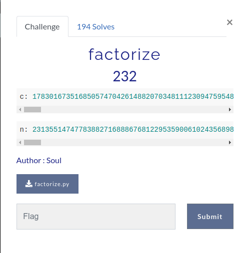
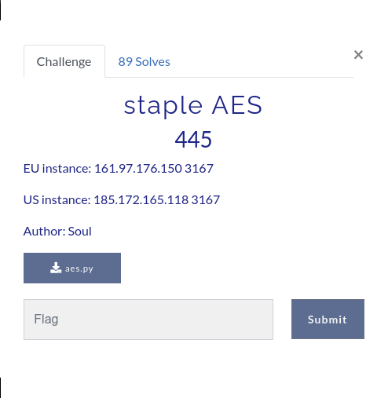

# Table of contents
- ## [factorize](#challenge-name-factorize)
- ## [staple AES](#challenge-name-staple-aes)
  
---

# Notes

### I'm using Ubuntu 20.04 as my environment.

---

# Challenge Name: factorize



## Information
1. ```c``` the encrypted message, was given
2. ```n``` the modulus, was given
3. ```n``` is constructed by two primes ```p,q``` which in this question, it's easily crackable and can be found on [factordb.com](http://factordb.com/index.php?query=23135514747783882716888676812295359006102435689848260501709475114767217528965364658403027664227615593085036290166289063788272776788638764660757735264077730982726873368488789034079040049824603517615442321955626164064763328102556475952363475005967968681746619179641519183612638784244197749344305359692751832455587854243160406582696594311842565272623730709252650625846680194953309748453515876633303858147298846454105907265186127420148343526253775550105897136275826705375222242565865228645214598819541187583028360400160631947584202826991980657718853446368090891391744347723951620641492388205471242788631833531394634945663)

## My solution

```
# Fermat at first, using yafu or factordb

c = 17830167351685057470426148820703481112309475954806278304600862043185650439097181747043204885329525211579732614665322698426329449125482709124139851522121862053345527979419420678255168453521857375994190985370640433256068675028575470040533677286141917358212661540266638008376296359267047685745805295747215450691069703625474047825597597912415099008745060616375313170031232301933185011013735135370715444443319033139774851324477224585336813629117088332254309481591751292335835747491446904471032096338134760865724230819823010046719914443703839473237372520085899409816981311851296947867647723573368447922606495085341947385255
n = 23135514747783882716888676812295359006102435689848260501709475114767217528965364658403027664227615593085036290166289063788272776788638764660757735264077730982726873368488789034079040049824603517615442321955626164064763328102556475952363475005967968681746619179641519183612638784244197749344305359692751832455587854243160406582696594311842565272623730709252650625846680194953309748453515876633303858147298846454105907265186127420148343526253775550105897136275826705375222242565865228645214598819541187583028360400160631947584202826991980657718853446368090891391744347723951620641492388205471242788631833531394634945663

p = 152103631606164757991388657189704366976433537820099034648874538500153362765519668135545276650144504533686483692163171569868971464706026329525740394016509191077550351496973264159350455849525747355370985161471258126994336297660442739951587911017897809328177973473427538782352524239389465259173507406981248869793
q = 152103631606164757991388657189704366976433537820099034648874538500153362765519668135545276650144504533686483692163171569868971464706026329525740394016509185464641520736454955410019736330026303289754303711165526821866422766844554206047678337249535003432035470125187072461808523973483360158652600992259609986591

e = 0x10001

# calculate lotietn 
import gmpy
lcm = gmpy.lcm(p-1,q-1)

#private key d
d = gmpy.invert(e,lcm)
d = int(d)

m = pow(c,d,n)
# print(m.bit_length())
print(m.to_bytes(48,"big"))
```
Output
```
$ python3 solve.py 

b'\x00\x00\x00\x00\x00\x00\x00\x00\x00\x00\x00\x00\x00\x00\x00flag{just_g0tta_f@ct0rize_1t4536}'
```

## Flag: flag{just_g0tta_f@ct0rize_1t4536}

---

# Challenge name: staple AES



## Information

> aes.py
```
import os
import socketserver
import string
import threading
from time import *
import random
import time
import binascii

from Crypto.Cipher import AES
from Crypto.Util.Padding import pad

iv = b''
key = b''
flag = open("flag.txt", "rb").read().strip()

class Service(socketserver.BaseRequestHandler):

    def handle(self):
        assert len(flag) % 16 == 1
        blocks = self.shuffle(flag)
        ct = self.encrypt(blocks)
        self.send(binascii.hexlify(ct))

    def byte_xor(self, ba1, ba2):
        return bytes([_a ^ _b for _a, _b in zip(ba1, ba2)])

    def encrypt(self, blocks):
        curr = iv
        ct = []
        cipher = AES.new(key, AES.MODE_ECB)
        for block in blocks:
            curr = cipher.encrypt(curr)
            ct.append(self.byte_xor(block, curr))
        return b''.join(ct)

    def shuffle(self, pt):
        pt = pad(pt, 16)
        pt = [pt[i: i + 16] for i in range(0, len(pt), 16)]
        random.shuffle(pt)
        return pt

    def send(self, string, newline=True):
        if type(string) is str:
            string = string.encode("utf-8")

        if newline:
            string = string + b"\n"
        self.request.sendall(string)

    def receive(self, prompt="> "):
        self.send(prompt, newline=False)
        return self.request.recv(4096).strip()


class ThreadedService(
    socketserver.ThreadingMixIn,
    socketserver.TCPServer,
    socketserver.DatagramRequestHandler,
):
    pass


def main():

    port = 3167
    host = "0.0.0.0"

    service = Service
    server = ThreadedService((host, port), service)
    server.allow_reuse_address = True

    server_thread = threading.Thread(target=server.serve_forever)

    server_thread.daemon = True
    server_thread.start()

    print("Server started on " + str(server.server_address) + "!")

    # Now let the main thread just wait...
    while True:
        sleep(10)


if __name__ == "__main__":
    main()
```

1. flag length must be multiple of 16 plus 1 (16n+1), clue from this line ```assert len(flag) % 16 == 1```
2. the flag will be splited into ```n``` parts, 16 characters long each, since flag's length must be (16n+1), there must be a part with only 1 character. ```pt = pad(pt, 16)``` will fill the part with 1 character with 15(s) ```\x0f```
3. the position of the parts will be shuffled randomly
4. after shuffling, the parts will be XOR'd with ```iv``` that is encrypted with ```key```
5. finally, the XOR'd parts outputs through port 3167
```
nc 161.97.176.150 3167

1210374ff7b52c4b265c3e4050e61d545ebdd73480b1dc2bdb8b6935241eb31f7853330bd83a066f8b05ac22656e18dd
```
6. the output frome the server is ```1210374ff7b52c4b265c3e4050e61d545ebdd73480b1dc2bdb8b6935241eb31f7853330bd83a066f8b05ac22656e18dd```, it's made up of 48 hexadecimal number, by the clues ```(16n+1) == len(flag)```and ```pt = pad(pt,16)``` we can confirm that ```n == 2```, and the output was splitted into 3 parts
7. The possibilities of the output is ```3! == 6```, so i requested a bunch to get all of them.

| no  | a                                | b                                | c                                |
| --- | -------------------------------- | -------------------------------- | -------------------------------- |
| 1   | 072e4b1f8fdb161b690c427c3c9b212f | 45deb95cf4f78c13bcb4135d4365e327 | 760e2133d4126c07a36aaa766e68749e |
| 2   | 072e4b1f8fdb161b690c427c3c9b212f | 4b83ab64f8dfe67b94db150948638f64 | 7853330bd83a066f8b05ac22656e18dd |
| 3   | 1c4d2577fb9d46230e3338145be07117 | 4b83ab64f8dfe67b94db150948638f64 | 63305d63ac7c5657ec3ad64a021548e5 |
| 4   | 1c4d2577fb9d46230e3338145be07117 | 5ebdd73480b1dc2bdb8b6935241eb31f | 760e2133d4126c07a36aaa766e68749e |
| 5   | 1210374ff7b52c4b265c3e4050e61d54 | 5ebdd73480b1dc2bdb8b6935241eb31f | 7853330bd83a066f8b05ac22656e18dd |
| 6   | 1210374ff7b52c4b265c3e4050e61d54 | 45deb95cf4f78c13bcb4135d4365e327 | 63305d63ac7c5657ec3ad64a021548e5 |

## My solution
1.  find all possible iv
> findiv.py
```
d = [
    ["072e4b1f8fdb161b690c427c3c9b212f",    "45deb95cf4f78c13bcb4135d4365e327",
        "760e2133d4126c07a36aaa766e68749e"],
    ["072e4b1f8fdb161b690c427c3c9b212f",    "4b83ab64f8dfe67b94db150948638f64",
        "7853330bd83a066f8b05ac22656e18dd"],
    ["1c4d2577fb9d46230e3338145be07117",    "4b83ab64f8dfe67b94db150948638f64",
        "63305d63ac7c5657ec3ad64a021548e5"],
    ["1c4d2577fb9d46230e3338145be07117",    "5ebdd73480b1dc2bdb8b6935241eb31f",
        "760e2133d4126c07a36aaa766e68749e"],
    ["1210374ff7b52c4b265c3e4050e61d54",    "5ebdd73480b1dc2bdb8b6935241eb31f",
        "7853330bd83a066f8b05ac22656e18dd"],
    ["1210374ff7b52c4b265c3e4050e61d54",    "45deb95cf4f78c13bcb4135d4365e327",
        "63305d63ac7c5657ec3ad64a021548e5"],
]

vuln = b"}"+b"\x0f"*15
iv_0 = []
for i in range(len(d)):
    iv_0.append([a^b for a,b in zip(vuln, bytes.fromhex(d[i][0]))])
    
print(iv_0)
```
Output
```
[[122, 33, 68, 16, 128, 212, 25, 20, 102, 3, 77, 115, 51, 148, 46, 32], [122, 33, 68, 16, 128, 212, 25, 20, 102, 3, 77, 115, 51, 148, 46, 32], [97, 66, 42, 120, 244, 146, 73, 44, 1, 60, 55, 27, 84, 239, 126, 24], [97, 66, 42, 120, 244, 146, 73, 44, 1, 60, 55, 27, 84, 239, 126, 24], [111, 31, 56, 64, 248, 186, 35, 68, 41, 83, 49, 79, 95, 233, 18, 91], [111, 31, 56, 64, 248, 186, 35, 68, 41, 83, 49, 79, 95, 233, 18, 91]]
```

2. Choose one of the iv, then XOR it with the first column of all the possiblities

> crack.py

```
test_iv_0 = bytes([122, 33, 68, 16, 128, 212, 25, 20, 102, 3, 77, 115, 51, 148, 46, 32])
for i in range(len(d)):
    ans = bytes([a^b for a,b in zip(test_iv_0,bytes.fromhex(d[i][0]))])
    print(ans)
```
Output
```
b'}\x0f\x0f\x0f\x0f\x0f\x0f\x0f\x0f\x0f\x0f\x0f\x0f\x0f\x0f\x0f'
b'}\x0f\x0f\x0f\x0f\x0f\x0f\x0f\x0f\x0f\x0f\x0f\x0f\x0f\x0f\x0f'
b'flag{I_7h0ught_7'
b'flag{I_7h0ught_7'
b'h1s_wa5_@_s3cr3t'
b'h1s_wa5_@_s3cr3t'
```
3. Rearrange the outputs

## Flag: flag{I_7h0ught_7h1s_wa5_@_s3cr3t}

---