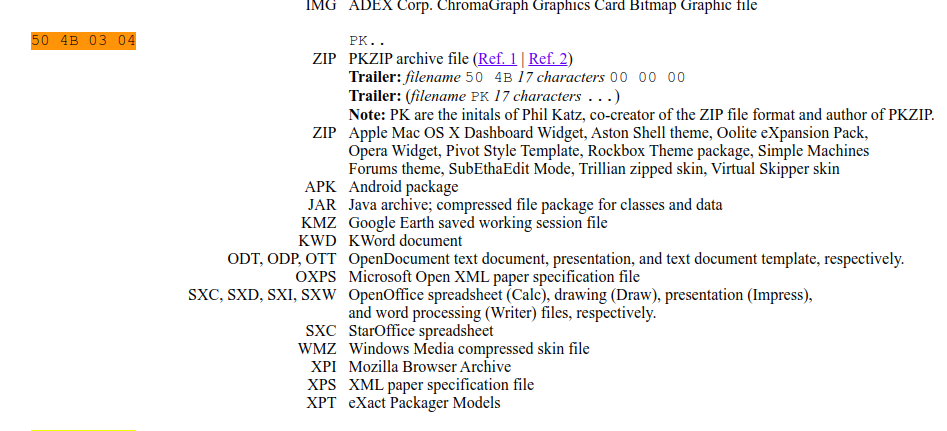

# Table of contents
- ## [optimizer](#challenge-name-optimizer)
- ## [0x414141](#challenge-name-0x414141)
  
---

# Notes

### I'm using Ubuntu 20.04 as my environment.

---
# Challenge name: optimizer


## Information
1. This challenges is to answer the questions from the server
2. There are two question, 1st one is calculate the minimum step to solved Tower Of Hanoi, 2nd one is calculate Inversion count(how far (or close) the array is from being sorted.)
3. I googled the solution and code for this challenge
4. Used pwntools to automate the process

## My solution
```
from pwn import *

def getInvCount(arr, n): 
  
    inv_count = 0
    for i in range(n): 
        for j in range(i + 1, n): 
            if (arr[i] > arr[j]): 
                inv_count += 1
  
    return inv_count 
    # print(inv_count)


r = remote("207.180.200.166",9660)
# Intro
print(r.recvline())

# Tower of Hanoi, ans = 2^n - 1
# https://en.wikipedia.org/wiki/Tower_of_Hanoi
print(r.recvuntil(":"))
print(r.recvline())


while True:
    inputs = r.recvline()
    inputs = inputs.decode("utf-8")
    print(inputs)
    if(inputs.startswith("> level")):
        break
    inputs = inputs.strip("> \n[]")
    print("strip",inputs)
    inputs = inputs.replace(" ","")
    inputs = inputs.split(",")
    # print(inputs)
    ans = pow(2,len(inputs))-1
    print(ans)
    r.send("%d\n"%(ans))

# Calculate Inversion

while True:
    inputs = r.recvline()
    inputs = inputs.decode("utf-8")
    print(inputs)
    if(inputs.startswith("> level")):
        break
    inputs = inputs.strip("> \n[]")
    print("strip",inputs)
    inputs = inputs.replace(" ","")
    inputs = inputs.split(",")
    for n in range(len(inputs)):
        inputs[n] = int(inputs[n])
    ans = getInvCount(inputs,len(inputs))
    # print(arr,ans)
    print(ans)
    r.send("%d\n"%(ans))
```

## Flag: flag{g077a_0pt1m1ze_3m_@ll}


>PS: at the time of writing this, the server is down so i wasn't able to show the script in action 🥺

---

# Challenge name: 0x414141


## Information
1. Offshift was mentioned, which was the sponsor of this CTF, and they have a github page
2. A repository was found ["promo"](https://github.com/offshift-protocol/promo)
3. There's a commit with offshift removed some file [link](https://github.com/offshift-protocol/promo/commit/f2112c46cafb86e3225901b011e4ea71858901a3)

## My solution

1. Download the .pyc file and decompile it using uncompyle6
> decompiled.py
```
# uncompyle6 version 3.7.4
# Python bytecode 3.8 (3413)
# Decompiled from: Python 3.8.5 (default, Jul 28 2020, 12:59:40) 
# [GCC 9.3.0]
# Embedded file name: ./script.py
# Compiled at: 2020-12-12 21:17:01
# Size of source mod 2**32: 481 bytes
import base64
secret = 'https://google.com'
cipher2 = [b'NDE=', b'NTM=', b'NTM=', b'NDk=', b'NTA=', b'MTIz', b'MTEw', b'MTEw', b'MzI=', b'NTE=', b'MzQ=', b'NDE=', b'NDA=', b'NTU=', b'MzY=', b'MTEx', b'NDA=', b'NTA=', b'MTEw', b'NDY=', b'MTI=', b'NDU=', b'MTE2', b'MTIw']
cipher1 = [base64.b64encode(str(ord(i) ^ 65).encode()) for i in secret]
```
2. there's somekind of cipher going on, time to decode it
```
Python 3.8.5 (default, Jul 28 2020, 12:59:40) 
[GCC 9.3.0] on linux
Type "help", "copyright", "credits" or "license" for more information.
>>> cipher2 = [b'NDE=', b'NTM=', b'NTM=', b'NDk=', b'NTA=', b'MTIz', b'MTEw', b'MTEw', b'MzI=', b'NTE=', b'MzQ=', b'NDE=', b'NDA=', b'NTU=', b'MzY=', b'MTEx', b'NDA=', b'NTA=', b'MTEw', b'NDY=', b'MTI=', b'NDU=', b'MTE2', b'MTIw']
>>> import base64
>>> ans = ""
>>> for b in cipher2:
...     ans += chr(int(base64.b64decode(b).decode("ascii"))^65)
... 
>>> print(ans)
https://archive.is/oMl59
```
3. [https://archive.is/oMl59](https://archive.is/oMl59) OwO

4. *Super secret random file* [https://mega.nz/file/AAdDyIoB#gpj5s9N9-VnbNhSdkJ24Yyq3BWSYimoxanP-p03gQWs](https://mega.nz/file/AAdDyIoB#gpj5s9N9-VnbNhSdkJ24Yyq3BWSYimoxanP-p03gQWs)
5. This link will give us a pdf file, *smashing.pdf*
6. By inspecting the bytes, it's clearly encrypted

```
$ hd smashing.pdf

00000000  64 11 05 07 6c 70 6f 75  4b 64 82 e5 82 fd 82 f7  |d...lpouKd......|
00000010  82 de 4b 73 61 71 61 2e  23 2b 4b 7d 7d 6e 0d 24  |..Ksaqa.#+K}}n.$|
00000020  2f 26 35 29 61 72 61 71  61 13 6e 07 28 2d 35 24  |/&5)araqa.n.(-5$|
00000030  33 6e 07 2d 20 35 24 05  24 22 2e 25 24 7f 7f 4b  |3n.- 5$.$".%$..K|
00000040  32 35 33 24 20 2c 4b 39  dd ec 1d 0a ca 65 f8 50  |253$ ,K9.....e.P|
00000050  ff 8e ee e9 f2 e0 9b 68  68 64 24 03 12 91 94 12  |.......hhd$.....|
00000060  32 b1 2c 20 81 46 a2 da  fc 47 5e 4d 9f ca be ff  |2., .F...G^M....|
00000070  64 84 1a 13 27 b7 5b f2  d1 1c da e4 06 69 a3 ca  |d...'.[......i..|
00000080  f6 2b d7 76 36 ba 8e f6  3e 9e d7 9a 3c 68 5e d2  |.+.v6...>...<h^.|
00000090  b2 a4 d8 b6 bb bd ac ae  f6 7e be a0 b7 ee b7 24  |.........~.....$|
000000a0  bc ae f6 3e 3d 3a bf bd  a7 83 bb 57 2f 28 1a 9e  |...>=:.....W/(..|
000000b0  97 9a 8e fe 9c bf b9 82  9c 1d b8 b5 aa 1e 9f 56  |...............V|
000000c0  b6 f9 ba b6 84 7e af af  3c 48 ce b4 3c 18 9a 86  |.....~..<H..<...|
000000d0  b9 f9 ee b5 7b f4 26 2f  42 f6 06 b8 f9 96 06 ba  |....{.&/B.......|
000000e0  b5 10 5e 8e 86 7c 97 26  39 1e 7f 9a e1 ae ce 3a  |..^..|.&9......:|
000000f0  81 94 21 dc ae b4 a2 3d  2d 1a a7 14 5e 7e a5 ea  |..!....=-...^~..|
00000100  b4 d0 ab bd 7b 54 07 80  73 e8 ff 47 db c1 8b 7b  |....{T..s..G...{|
00000110  98 6c 34 c5 32 34 c5 b2  6f 89 56 aa e2 fd ce b1  |.l4.24..o.V.....|
00000120  bf d0 28 80 fb c0 0a ce  fe bf bd 92 f6 96 8e 2e  |..(.............|
00000130  fe 35 dd b3 28 fe e4 34  3a 0a 81 66 3e 32 d4 82  |.5..(..4:..f>2..|
00000140  89 68 21 15 7a db 1a 5b  4c f0 d3 57 5b ca 8b 86  |.h!.z..[L..W[...|
00000150  1d b7 fc a6 8b de dc 07  3f f5 6e a1 b2 b2 50 28  |........?.n...P(|
00000160  53 6c 31 09 04 fb e4 d1  06 5b 9b 27 09 42 ae ae  |Sl1......[.'.B..|
.
.
.

```
7. after comparing the file with a real pdf file, the encryption pattern was discovered
   
| bytes range | is odd? | is even? |
| ----------- | ------- | -------- |
| [0 - 64)    | += 63   | +=65     |
| [64 - 128)  | -= 65   | -=63     |
| [128 - 192) | += 63   | +=65     |
| [192 - 256) | -= 65   | -=63     |

> decrypt.py
```
modified = bytearray()

with open("smashing.pdf","rb") as f:
    modified = f.read()


original = bytearray()
counter = 0
for b in modified:
    if(b <= 63 or (b > 127 and b <= 191)):
        if(b % 2 != 0):
            original.append((b + 63)& 0xff)
        else:
            original.append((b + 65)& 0xff)
    else:
        if(b % 2 != 0):
            original.append((b - 65)& 0xff)
        else:
            original.append((b - 63)& 0xff)

with open("ori.pdf","wb") as f:
    f.write(original)
```
8. The decrypted pdf file : *Bitcoin: A Peer-to-Peer Electronic Cash System. by Satsoshi Nakamoto* [ori.pdf](../files/ori.pdf)

9. Further inspecting the decrypted.pdf
```
hd ori.pdf | tail -n 10
0002cfb0  35 31 34 44 46 41 44 32  33 46 41 42 43 43 37 41  |514DFAD23FABCC7A|
0002cfc0  35 35 30 30 32 31 41 46  37 0a 3e 3e 0a 73 74 61  |550021AF7.>>.sta|
0002cfd0  72 74 78 72 65 66 0a 31  38 32 37 32 37 0a 25 25  |rtxref.182727.%%|
0002cfe0  45 4f 46 0a 50 4b 03 04  0a 00 09 00 00 00 ec 4e  |EOF.PK.........N|
0002cff0  8c 51 6a 94 f3 44 41 00  00 00 35 00 00 00 08 00  |.Qj..DA...5.....|
0002d000  1c 00 66 6c 61 67 2e 74  78 74 55 54 09 00 03 8c  |..flag.txtUT....|
0002d010  93 d4 5f 90 93 d4 5f 75  78 0b 00 01 04 00 00 00  |.._..._ux.......|
0002d020  00 04 00 00 00 00 bf de  e6 f8 05 c0 f0 44 e9 5b  |.............D.[|
0002d030  bc fc 5f 7f 59 f0 f1 df  db 40 36 69 c7 ec 2d 37  |.._.Y....@6i..-7|
0002d040  c6 cb 87 0f 23 ee f7 b1  15 0a 11 b0 e5 33 9d dc  |....#........3..|
0002d050  ea cc 24 ba 35 d7 6f 3c  b3 ab 81 5a 67 ff 99 e2  |..$.5.o<...Zg...|
0002d060  f4 07 85 f6 9c 29 77 50  4b 07 08 6a 94 f3 44 41  |.....)wPK..j..DA|
0002d070  00 00 00 35 00 00 00 50  4b 01 02 1e 03 0a 00 09  |...5...PK.......|
0002d080  00 00 00 ec 4e 8c 51 6a  94 f3 44 41 00 00 00 35  |....N.Qj..DA...5|
0002d090  00 00 00 08 00 18 00 00  00 00 00 01 00 00 00 a4  |................|
0002d0a0  81 00 00 00 00 66 6c 61  67 2e 74 78 74 55 54 05  |.....flag.txtUT.|
0002d0b0  00 03 8c 93 d4 5f 75 78  0b 00 01 04 00 00 00 00  |....._ux........|
0002d0c0  04 00 00 00 00 50 4b 05  06 00 00 00 00 01 00 01  |.....PK.........|
0002d0d0  00 4e 00 00 00 93 00 00  00 00 00                 |.N.........|
0002d0db
```
10. File signature of ```50 4b 03 04``` was found, which was a zip file


11. Time to extract the zip file
> extract_zip.py

```
somebytes = bytearray()

with open("ori.pdf","rb") as f:
    somebytes = f.read()

hidden_zip = bytearray()
for i in range(0x2cfe4,len(somebytes)):
    hidden_zip.append(somebytes[i])
with open("hidden.zip","wb") as f:
    f.write(hidden_zip)
        
somebytes = bytearray()

with open("hidden.zip","rb") as f:
    somebytes = f.read()

```

> hidden.zip
```
unzip -v hidden.zip
Archive:  hidden.zip
 Length   Method    Size  Cmpr    Date    Time   CRC-32   Name
--------  ------  ------- ---- ---------- ----- --------  ----
      53  Stored       53   0% 2020-12-12 17:55 44f3946a  flag.txt
--------          -------  ---                            -------
      53               53   0%                            1 file
```
12. Let's unzip it
```
unzip hidden.zip

Archive:  hidden.zip
[hidden.zip] flag.txt password: 
```

13. argh, it need a password to open, at the time i am solving this, i'm afraid that the password could be too secure and i can't unzip it
14. But luckily there's a tool called fcrackzip in ubuntu that can bruteforce the password, i feeded it with the legendary *rockyou.txt* and found the password and the flag!!
```
fcrackzip -Duv -p ~/hydra/wordlist/rockyou.txt hidden.zip

found file 'flag.txt', (size cp/uc     65/    53, flags 9, chk 4eec)

PASSWORD FOUND!!!!: pw == passwd
```
```
unzip hidden.zip flag.txt ; cat flag.txt

Archive:  hidden.zip
[hidden.zip] flag.txt password:

 extracting: flag.txt                
oh ma gawd you got it 

flag{1t_b33n_A_l0ng_w@y8742}
```

## Flag: flag{1t_b33n_A_l0ng_w@y8742}

---