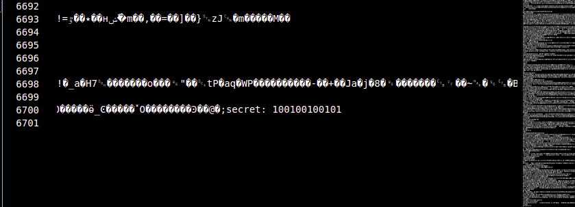

# Table of contents
- ## [RegisterPIN](#register-pin)
  
---

# Notes

### I'm using Ubuntu 20.04 as my environment.

---

# Register PIN

## Information


> $Cool$


## My solution

1. Download that freaking logo
2. Open it with text editor



3. Convert that ```100100100101``` to decimal number

```
Python 3.8.5 (default, Jul 28 2020, 12:59:40) 
[GCC 9.3.0] on linux
Type "help", "copyright", "credits" or "license" for more information.
>>> 0b100100100101
2341
```

4. That's all, the PIN is ```2341```.🤣

---