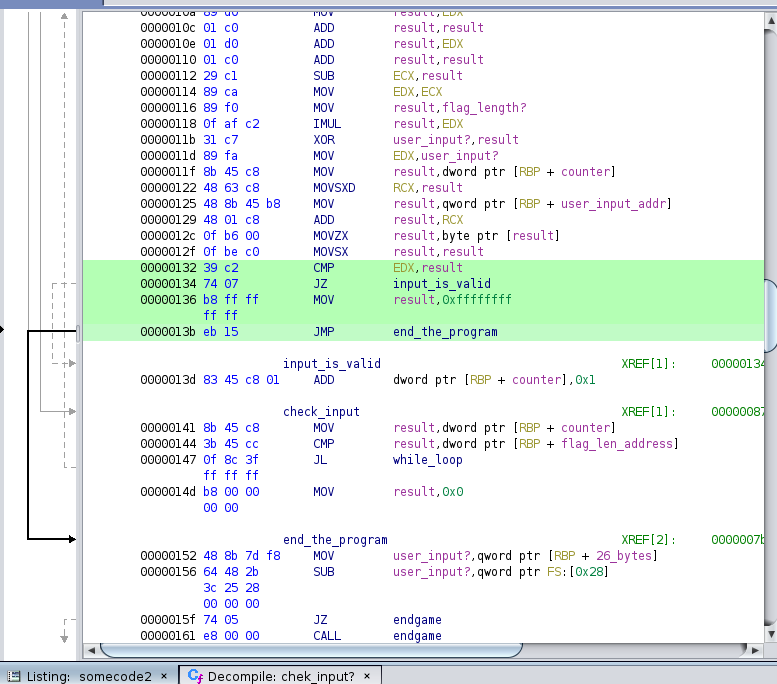

# Table of contents
- ## [x and or](#challenge-x-and-or)
  
---

# Notes

### I'm using Ubuntu 20.04 as my environment.

---

# Challenge Name : x and or


## Information
```
./x-and-or

Enter the flag: testtesttest
That is not the flag.
```

## My solution
1. I think i used the most time consuming way to solve this
2. first, i decompile it using ghidra,
3. at 0x12a7, there's a call rcx instruction, which is the memory address of the function that check the flag


4. upon further investigation, the address RCX is pointing to is a piece of instruction code generated while the program is running


5. the piece of instruction code is XOR'd with 0x42 for 500 bytes starting from address of ```check_password```

> XOR_500_bytes.py
```
d = "0a cb a7 0a c1 ae 12 0a cb 3f fa cb 37 f6 26 0a c9 46 67 6a 42 42 42 0a cb 07 ba 73 82 0a fa 24 2f 2b 3e 79 0a 74 73 0a f8 7c 6a 35 5b 21 73 2e 3a 0a cb 07 92 0a cb 17 9a 0a fa 66 0c 71 21 7f 3f 64 0c 0a f8 75 7b 72 69 61 5e 73 73 0a cb 07 a2 0a cb 17 aa 85 07 b2 28 6b 36 59 24 85 07 b6 20 3e 84 07 b4 42 85 07 8e 64 42 42 42 c9 07 8e 79 07 f6 36 48 fa bd bd bd bd ab 90 42 42 42 85 07 8a 42 42 42 42 ab f7 42 42 42 c9 07 8a 0a da 4d f4 06 47 92 4d fc ba c9 17 8a 0a 21 80 0a 2b 82 e9 e8 e8 68 0a 83 aa 62 cb 94 83 bc 5d cb 83 6b b3 cb 8a 43 82 43 8a 43 82 cb 93 6b 83 c9 37 8a 0a 21 84 0a 2b 82 e9 e8 e8 68 0a 83 aa 62 03 cb b2 03 83 ba 5d cb 80 06 6b 80 cb 92 43 82 43 92 43 82 6b 84 cb b0 cb 8c 4d ed b0 c9 0f 8a 0a 21 83 0a 2b 82 e9 e8 e8 68 0a 83 aa 62 03 cb 8a 03 83 ba 5d cb 80 06 6b 80 cb 92 43 82 43 92 43 82 6b 83 cb 88 cb b2 4d ed 80 73 85 cb b8 c9 07 8a 0a 21 8a 0a c9 07 fa 0a 43 8a 4d f4 42 4d fc 82 7b 80 36 45 fa bd bd bd bd a9 57 c1 07 8a 43 c9 07 8a 79 07 8e 4d ce 7d bd bd bd fa 42 42 42 42 0a c9 3f ba 26 0a 69 7e 67 6a 42 42 42 36 47 aa 42 42 42 42 8b 81 01 1b 03 3b 38 00 00 00 06 00 00 00 74 ee ff ff 6c 00 00 00 f4 ee ff ff 94 00 00 00 64 ef ff ff 54 00 00 00 64 f0 ff ff ac 00 00 00 44 f1 ff ff cc 00 00 00 b4 f1 ff ff 14 01 00 00 14 00 00 00 00 00 00 00 01 7a 52 00 01 78 10 01 1b 0c 07 08 90 01 00 00 14 00 00 00 1c 00 00 00 08 ef ff ff 2f 00 00 00 00 44 07 10 00 00 00 00 24 00 00 00 34 00 00 00 00 ee ff ff 80 00 00 00 00 0e 10 46 0e 18 4a 0f 0b 77 08 80 00 3f 1a 3b 2a"

some_code = b""
for n in d.split(" "):
    some_code+=(int(n,16)^0x42).to_bytes(1,"big")

with open("somecode2","wb") as f:
    f.write(bytes(some_code))
```
After xor'd with 0x42, the 500 bytes will be a valid assembly instruction

This is the decompiled code, in C syntax


6. even though the code in C syntax are decompiled, for some reason i can't reverse the flag by following the code, so i ended up finding the flag character by character in gdb by patching
```
CMP EDX, $some_var
JZ $some_function
MOV $some_var 0xffffffff
JMP $some_function
```

to ```\x90```(s)


which address are 0x132 till 0x13b



```
(gdb) break *0x00005555555552a7
Breakpoint 4 at 0x5555555552a7

(gdb) break *0x7ffff7ffb000+0x132
Breakpoint 7 at 0x7ffff7ffb132
(gdb) set write on
(gdb) set *0x7ffff7ffb132 = 0x07749090
(gdb) set *0x7ffff7ffb134 = 0x90909090
(gdb) set *0x7ffff7ffb138 = 0x90909090
(gdb) set *0x7ffff7ffb13c = 0xc8458390
(gdb) cont

Breakpoint 5, 0x00007ffff7ffb132 in ?? ()
(gdb) info register
rax            0x66                102
rbx            0x5555555552f0      93824992236272
rcx            0x0                 0
rdx            0x66                102
.
.
.
(gdb) cont
Continuing.

Breakpoint 7, 0x00007ffff7ffb132 in ?? ()
(gdb) info r
rax            0x43                67
rbx            0x5555555552f0      93824992236272
rcx            0x9                 9
rdx            0x33                51
.
.
.
Breakpoint 7, 0x00007ffff7ffb132 in ?? ()
(gdb) info r
rax            0x43                67
rbx            0x5555555552f0      93824992236272
rcx            0x22                34
rdx            0x34                52
.
.
.
(gdb) cont
Continuing.
That is the flag!!!!
[Inferior 1 (process 208119) exited normally]
(gdb) 
```

## Flag: flag{560637dc0dcd33b5ff37880ca10b24fb}

---